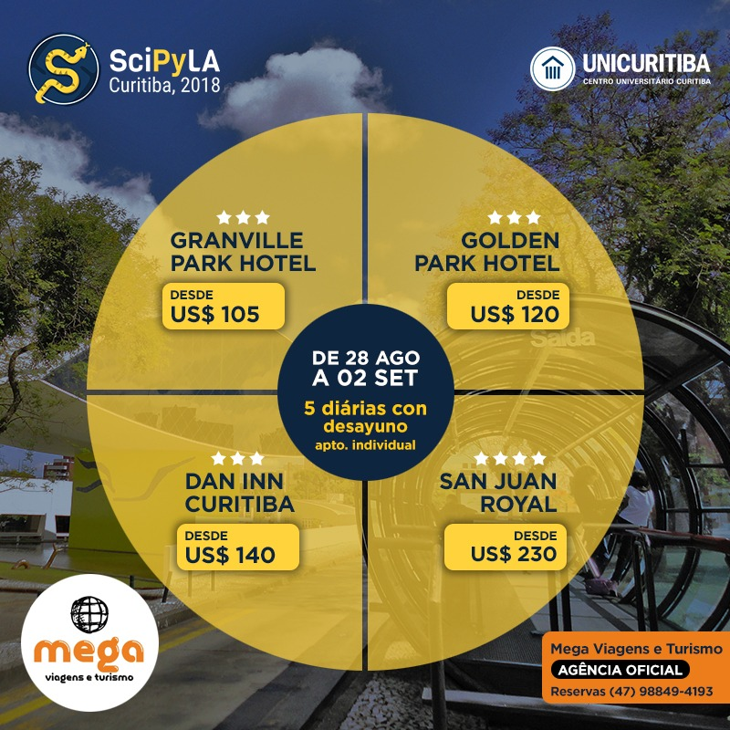

## Hospedaje y Transporte

La agencia Mega Viajes Turismo ha preparado algunos paquetes de alojamiento con precios diferenciados para participantes del SciPyLA. El contacto debe ser hecho directamente con la Mega Viajes Turismo:

- Email: [adriana@megaviagenseturismo.com.br](mailto:adriana@megaviagenseturismo.com.br)
- WhatsApp: +55 (47) 98849-4193
- Sitio web: [www.megaviagenseturismo.com.br/contato](www.megaviagenseturismo.com.br/contato)

## PAQUETES

Los valores de referencia comprenden 5 diarios en apartamento individual con desayuno entre el 28 de agosto y el 2 de septiembre:

- Granville Park Hotel, desde U$ 105.00
- Golden Park Hotel, desde U$ 120.00
- Dan Inn Curitiba, desde U$ 140.00
- San Juan Royal, desde U$ 230.00

## OBSERVACIONES:

- Para los visitantes de otros países el valor es sólo para el pago anticipado
- Los valores sólo de referencia, deben ser confirmados directamente con MEGA Viajes y Turismo a través del whatsapp (47) 98849-4193 oa través del email: [adriana@megaviagenseturismo.com.br](mailto:adriana@megaviagenseturismo.com.br)
