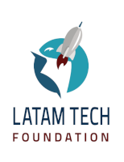

# Patrocinadores

Es con inmensa gratitud que reconocemos el apoyo de nuestros patrocinadores. Gracias al apoyo recibido será posible recibir a los participantes del evento en Curitiba para mucho intercambio de conocimiento, mucha ciencia y confraternización.

## **Gold**

### Latam Tech

La Fundación LatamTech es una organización sin fines de lucro enfocada en el desarrollo del sector de tecnología de América Latina y el Caribe.

El apoyo de la Fundación Latam Tech ha sido de suma importancia para cubrir los costos del evento. Gracias al Vicepresidente Ejecutivo de LatamTech, Olemis Lang, este patrocinio fue viabilizado.

## **Sede**

###  UniCuritiba

La Universidad Curitiba viene apoyando diversos eventos de tecnología, entre ellos la SciPyLA 2018. Con el apoyo del profesor Bruno Weber la Universidad será la sede del evento y recibirá a los participantes con la estructura y confort necesarios para un excelente evento.

# Apoyo

|  |  |  |
|:---:|:---:|:---:|

|  |  |   |
|:---:|:---:|:---:|

#  Organización

|  |  |  |
|:---:|:---:|:---:|