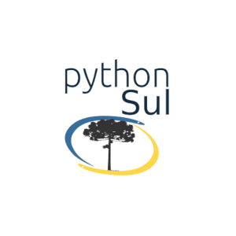

# SciPyLA 2018

Conferência Latinoamericana de Computação Científica com Python

Mais PYTHON , Mais CIÊNCIA 

De 29 de agosto e 1 de setembro de 2018, Curitiba, Paraná, Brasil!

Fotógrafo da UniCuritiba, CC BY

A Conferência Latino Americana de Python Científico tem como objetivo disseminar a Ciência, Computação Científica e tecnologias relacionadas com a linguagem de programação Python. A Conferência não possui fins lucrativos e reune profissionais e pesquisadores com conhecimento em diversas áreas da tecnologia.

É a sexta conferência anual de computação científica com Python. Esta ocorreu entre 29 de agosto e 01 de setembro de 2018 em Curitiba, Brasil. A comunidade SciPy se dedica ao avanço da computação científica através de softwares de código aberto feito em Python para resolver problemas matemáticos, ciência e de engenharia.

A conferência foi realizada no campus da [UniCuritiba](http://unicuritiba.edu.br/), Curitiba, PR, Brasil.

O evento custou cerca de R$ 13 mil reais, gastos assim:

## Tutoriais

Fotógrafo Paulo Henrique Santana, CC BY

Tivemos três tutoriais no dia 29 de agosto 2018, relacionados à linguagem. Dois tutoriais de 6 horas, _Let's build a blockchain! Coding a mini-cryptocurrency in Python_ com João Sebastião de Oliveira Bueno que apresentou os conceitos de blockchain e criptomoedas bem como os passos para implementar uma criptomoeda em Python. Arthur Fortes da Costa ensinou a criar um sistema de recomendação com Python no tutorial _Case Recommender: Utilizando Python para desenvolver sistemas de recomendação_. Um tutorial foi de 3 horas, _Python Básico_ com o professor Leonardo Gomes os alunos viram o básico de Python.

Fotógrafo Paulo Henrique Santana, CC BY

## Palestras

Tivemos 12 palestras nesta edição do evento, distribuídas em dois dias, 4 delas foram apresentadas por Keynotes convidados.

- Quinta (30/08/2018)
  - Keynote - Carlos Cordoba.
  - Plotando Dados Do Zero: Customizando Seus Resultados Com Python - João Sebastião de Oliveira Bueno.
  - Simulating A Electric Car Sharing Operation With Python - Sergio Bastos
  - My Scientific Python Toolbox - Ariel Rossanigo
  - ** Mathematical Optimization On The Julia Language - Abel Siqueira
  - Keynote - Juan Funez

- Sexta (31/08/2018)
  - Image processing with deep learning - Ariel Rossanigo
  - Keynote - Leticia Portella
  - Datawarehousing Para Datos Genéticos, Socioeconómicos Y Fenotípicos, Con Visualización 3D - Luciano Serruya
  - A Guide To Understand And Build A Recommender System Engine - Arthur Fortes da Costa
  - Construindo uma plataforma para execução de algoritmos de Data Science - Lucas Kotres
  - Keynote - Melissa W. Mendonça

** A organização cometeu um equivoco e a palestra não foi apresentada. Nossas sinceras desculpas aos participantes e em especial ao professor Abel Siqueira.

## Lightning Talks

_Lightning talk_ é uma palestra bem curta, de no máximo 5 minutos. As submissões são feitas na hora, e _qualquer_ pessoa pode submeter! Não há restrições quanto ao tema. Quando o cronômetro indica 5 minutos, o palestrante é aplaudido e o próximo entra :D

Tivemos duas sessões de palestras relâmpago.

## Sprints

Os *sprints* de desenvolvimento são uma parte chave de grande parte dos eventos de Python ao redor do mundo. Durante os *sprints* os participantes tem a chance de contribuir para projetos *open-source* em dias intensos de aprendizagem. Novatos podem trabalhar com pessoas mais experientes proporcionando um ótimo ambiente de troca de experiências para todos.

O *sprint* é o momento para testar, corrigir *bugs*, adicionar novas *features* e melhorar a documentação de projetos que você utiliza e gostaria de contribuir. O *sprint* também é uma ótima oportunidade para fazer amigos, *networking* e criar relações que se extenderão até após a conferência.

No sábado, 01 de setembro de 2018, os corajosos que sobreveviram aos três dias anteriores do evento se reuniram na [UniCuritiba](http://unicuritiba.edu.br/) para contribuir com:

* [Spyder IDE](https://github.com/spyder-ide/spyder)

  Spyder IDE é um ambiente de desenvolvimento Python Científico.

* Oficina de colaboração com git e github

  Alunos da [UniCuritiba](http://unicuritiba.edu.br/) participaram de uma oficina para aprender a utilizar o git, github e o processo de colaboração com software livre hospedado no github.

* [Rows](https://github.com/turicas/rows)

  Colaboração com a biblioteca rows, [issue 286](https://github.com/turicas/rows/issues/286)

## Agradecimentos

### Patrocinadores

É com imensa gratidão que reconhecemos o apoio dos nossos patrocinadores. Graças ao apoio recebido foi possível receber os participantes do evento em Curitiba para muita troca de conhecimento, muita ciência e confraternização.

## **Gold**

### Latam Tech

A Fundação LatamTech é uma organização sem fins lucrativos focada no desenvolvimento do setor de tecnologia da América Latina e Caribe.

O apoio da Fundação Latam Tech tem sido de suma importância para cobrir os custos do evento. Graças ao Vice Presidente Executivo da LatamTech, Olemis Lang, esse patrocínio foi viabilizado.

## **Sede**

###  UniCuritiba

A Universidade Curitiba vem apoiando diversos eventos de tecnologia, dentre eles a SciPyLA 2018. Com o apoio do professor Bruno Weber a Universidade foi a sede do evento e recebeu os participantes com a estrutura e conforto necessários para um excelente evento.

# Apoio

|  |  |  |
|:---:|:---:|:---:|

|  |  |  |
|:---:|:---:|:---:|

#  Organização

|  |  |  |
|:---:|:---:|:---:|
