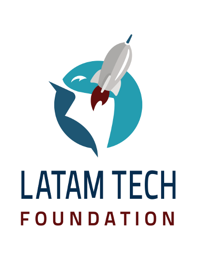
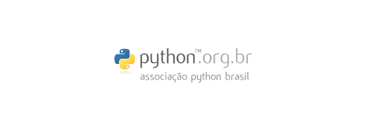
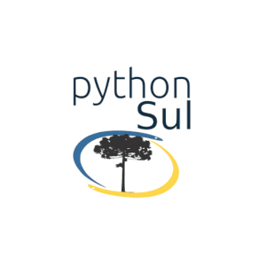

# Patrocinadores

É com imensa gratidão que reconhecemos o apoio dos nossos patrocinadores. Graças ao apoio recebido será possível receber os participantes do evento em Curitiba para muita troca de conhecimento, muita ciência e confraternização.

## **Gold**

### Latam Tech

A Fundação LatamTech é uma organização sem fins lucrativos focada no desenvolvimento do setor de tecnologia da América Latina e Caribe.

O apoio da Fundação Latam Tech tem sido de suma importância para cobrir os custos do evento. Graças ao Vice Presidente Executivo da LatamTech, Olemis Lang, esse patrocínio foi viabilizado.

## **Sede**

###  UniCuritiba

A Universidade Curitiba vem apoiando diversos eventos de tecnologia, dentre eles a SciPyLA 2018. Com o apoio do professor Bruno Weber a Universidade será a sede do evento e irá receber os participantes com a estrutura e conforto necessários para um excelente evento.

# Apoio

|  |  |  |
|:---:|:---:|:---:|

|  |  |  |
|:---:|:---:|:---:|

#  Organização

|  |  |  |
|:---:|:---:|:---:|